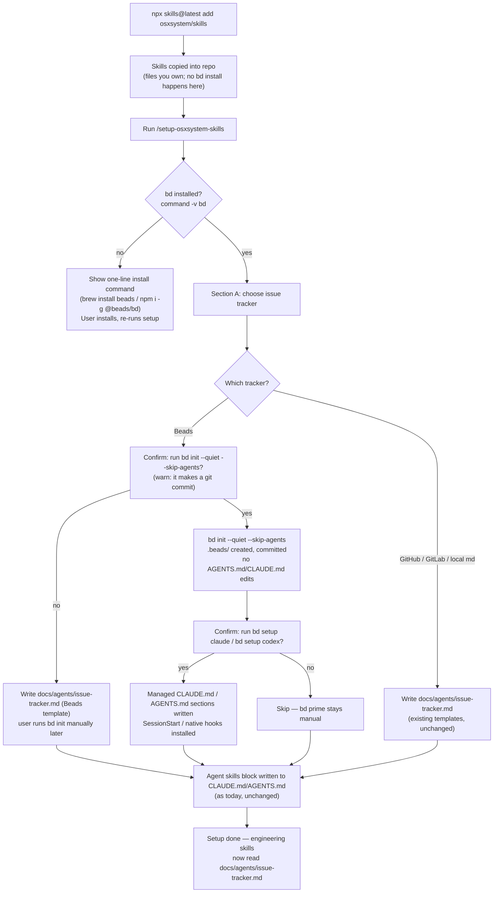
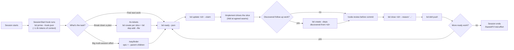

# Beads adoption — design

**Date:** 2026-08-09
**Status:** Proposed
**Scope:** This repo (`osxsystem/skills`) only. Nothing outside the repo is touched. No file was written to `research/beads-adoption.md`'s probe repos (`/tmp/*`) that this repo depends on — those were throwaway.

## Goal

Adopt [Beads](https://beads.gascity.com) (`bd`) — a dependency-aware issue tracker built for coding agents — as an **optional** backend behind `setup-osxsystem-skills`, so a repo that wants agent-native task tracking can get it, without forcing it on repos that don't. Consumers pulling this fork via `npx skills@latest add osxsystem/skills` get Beads as a documented, opt-in follow-up step — never a silent side effect of the install.

Full research backing every decision below: [research/beads-adoption.md](../../../research/beads-adoption.md).

## Decisions made

1. **Beads is opt-in, CLI-first, no plugin.** Matches this fork's own no-plugin stance (ADR [0002](../../../.agents/adr/0002-ship-as-a-claude-code-plugin.md)). The Claude Code plugin adds only `/beads:*` slash commands over the same CLI — never required.
2. **`npx skills` cannot install `bd`.** Verified: the `skills` npm package has no lifecycle hooks and no dependency-declaration field in `SKILL.md` frontmatter. Beads rides along as a *documented manual step*, not an automated one. See research §8.
3. **Beads becomes a fourth issue-tracker backend** in `setup-osxsystem-skills`, alongside GitHub, GitLab, and local markdown — not a fifth thing bolted on top. It is mutually exclusive with the local-markdown backend: `bd prime`'s own rules prohibit markdown task tracking once Beads is active, so a repo picks one.
4. **We do not ship a Beads workflow skill.** `bd init` / `bd setup codex` already installs `.agents/skills/beads/SKILL.md` in our exact `SKILL.md` + `agents/openai.yaml` shape. Writing our own would duplicate it.
5. **`setup-osxsystem-skills` runs the preflight and the safe subset of `bd init`.** It never runs `bd init` bare (that command writes `AGENTS.md`/`CLAUDE.md` and auto-commits — verified). It offers `bd init --quiet --skip-agents` plus `bd setup claude`/`bd setup codex` as separate, visible steps the user confirms.
6. **`resolving-merge-conflicts` gets a one-line pointer, not a rewrite.** Beads issue-data conflicts resolve via `bd doctor --fix`, a different mechanism from the hunk-by-hunk git resolution that skill already owns.

## Install-flow options considered

| Option | What it does | Verdict |
|---|---|---|
| A — Silent auto-install via `npx skills` postinstall | Install `bd` automatically when skills are pulled | **Not possible.** `skills` npm has no lifecycle hooks (verified by unpacking the tarball). |
| B — Bundle a `bd` binary in the repo | Ship a vendored binary, skills reference it directly | Rejected. Platform-specific binaries in a skills repo is exactly the kind of hard-to-reverse, binary-blob dependency this fork avoids; also breaks the "editable files you own" model of skills.sh installs. |
| C — Detect + guide, opt-in setup step (**chosen**) | `setup-osxsystem-skills` (or a small standalone step) detects `bd`, prints the one-line install command if missing, and only wires integration once the user has it installed and confirms | Matches how this skill already handles the issue tracker choice — explore, present, confirm, write. Nothing forced, nothing silent. |

Option C is what's implemented below.

## Changes by file

### 1. `skills/engineering/setup-osxsystem-skills/SKILL.md` — Section A gains a fourth option

Add **Beads** as a fourth choice in "Section A — Issue tracker", between local markdown and "Other":

> - **Beads** — issues live in a local Beads (`bd`) database, dependency-aware and synced via `bd dolt push/pull` over this repo's own git remote. Good for repos that want agents to track ready work, claims, and blockers natively instead of via labels or files.

Before offering it, run the preflight (research §9):

```bash
command -v bd >/dev/null 2>&1 && bd version
```

- **`bd` found:** offer Beads as a live option.
- **`bd` not found:** still list it, but the recommended line says "not installed — see the one-line install command for your platform" and links `docs/agents/issue-tracker.md`'s Beads template, which carries the install command. Choosing it here only writes the doc; it does not run `bd init` for the user, since that requires a human to have the binary first.

If chosen, and `bd` is present, confirm before running anything stateful. **`bd init` always makes a git commit** (verified — there is no `--no-commit` flag; only `--stealth`/`--setup-exclude` avoid repo tracking entirely), so say that plainly before running it:

- `bd init --quiet --skip-agents` — creates `.beads/` and commits it (`.beads/*` + `.gitignore` only — verified the staging is selective, not `git add -A`). `--skip-agents` stops it from writing into `AGENTS.md`/`CLAUDE.md` or installing `.claude/`/`.codex/`/`.agents/skills/beads/`, but **does not** stop the commit. If `AGENTS.md` or `CLAUDE.md` happen to be untracked at this point, they get swept into that same commit — flag this explicitly if either file is untracked before running.
- Then, separately, ask whether to run `bd setup claude` and/or `bd setup codex` — these write the managed `CLAUDE.md`/`AGENTS.md` sections and install session hooks. Show the diff before writing, same as every other write this skill makes.

### 2. New template — `skills/engineering/setup-osxsystem-skills/issue-tracker-beads.md`

Seed content, following the shape of the three existing templates:

```markdown
# Issue tracker: Beads

Issues for this repo live in a local Beads (`bd`) database, synced via Dolt over this repo's own git remote.

## Prerequisites

`bd` is not bundled with this skill set — install it once per machine:

    brew install beads        # macOS/Linux, recommended
    npm i -g @beads/bd        # if you're already in a Node toolchain

Verify: `bd version` (needs 0.59.0+ for sync; this repo's setup was last checked against 1.1.0).

## Conventions

- **Create an issue**: `bd create "<title>" --description="<why + what>" -t <bug|task|feature|epic|chore> -p <0-4> --json`
- **Read an issue**: `bd show <id> --json`
- **List issues**: `bd list --status open --json`, `bd ready --json` for the claimable frontier
- **Comment**: `bd comment <id> "..."`
- **Close**: `bd close <id> --reason "..." --json`
- Priority is `0` (critical) through `4` (backlog) — never "high"/"medium"/"low".

## When a skill says "publish to the issue tracker"

`bd create` the issue, with `--description` carrying the spec/slice body.

## When a skill says "fetch the relevant ticket"

`bd show <id> --json`.

## Wayfinding operations

Used by `/wayfinder`. The **map** is an epic; **children** are beads created with `--parent`.

- **Map**: `bd create "<effort>" -t epic -p <n>` — the Notes / Decisions-so-far / Fog body goes in `--description`, updated via `bd update <id> --description=...`.
- **Child ticket**: `bd create "<question>" --parent <map-id> -t task`. A `Type:` label (`research`/`prototype`/`grilling`/`task`) via `--label`.
- **Blocking**: `bd dep add <child> <blocker>` (default type `blocks`). Bulk-wire with `bd dep add --file deps.jsonl`.
- **Frontier**: `bd ready --json`, filtered to the map's children.
- **Claim**: `bd update <id> --claim` — atomic; safe with multiple agents.
- **Resolve**: `bd close <id> --reason "<answer gist>"`, then append the same gist + link to the map's Decisions-so-far via `bd update <map-id> --description=...`.

## Merge conflicts in issue data

Beads issue-data conflicts (from `bd dolt pull`) are not git hunk conflicts — do not run `/resolving-merge-conflicts` on them. Instead: `bd doctor` → `bd doctor --fix` → `bd list` / `bd stats` to verify → `bd dolt push`.
```

### 3. `skills/engineering/resolving-merge-conflicts/SKILL.md` — one-line pointer (append-only)

Add a short note near the top: this skill resolves **code** merge/rebase conflicts by intent; a repo using Beads resolves **issue-data** conflicts with `bd doctor --fix` instead (see `docs/agents/issue-tracker.md` if the repo's tracker is Beads). No workflow logic changes.

### 4. `README.md` — one mention, not a new install route

Under "3. Bam - you're ready to go" in the top-level README, add a short optional line: agents can also track work with Beads if the repo opts in during `/setup-osxsystem-skills`; link to `docs/agents/issue-tracker.md`'s Beads template location and to beads.gascity.com. This is documentation of an existing skill's new option, not a second install command — the canonical install block in `.agents/install-block.md` is untouched.

### 5. Explicitly not touched

- `.agents/install-block.md` — the install story stays `npx skills@latest add osxsystem/skills`; Beads is never part of it.
- Any file under `skills/mobile/`.
- `package.json` / release machinery.
- This repo's own `AGENTS.md`/`CLAUDE.md`/git history — `bd init` is never run here (this repo ships skills, it doesn't consume them).

## Daily workflow — how skills and Beads meet

Once a consuming repo opts in, the loop looks like this. Beads' own `bd prime` hook injects ~1-2k tokens of workflow context at session start (Claude Code SessionStart hook, or Codex native hooks) — no skill needs to re-teach that; skills only need to know *when* to reach for `bd` instead of a label or a file.

| Moment | Without Beads (local markdown) | With Beads |
|---|---|---|
| Break a plan into tickets (`/to-tickets`) | Write `.scratch/<feature>/issues/NN-*.md` | `bd create` per slice + `bd dep add --file` for blocking edges |
| Find next work | Scan issue files for unblocked ones | `bd ready --json` |
| Claim work | Edit a `Status:` line | `bd update <id> --claim` (atomic) |
| Discover follow-up work mid-implementation | New markdown file | `bd create --deps discovered-from:<id>` |
| Finish a slice (`/implement`) | Update `Status:` to done | `bd close <id> --reason "..."` |
| Multi-session planning (`/wayfinder`) | Map + child files | Epic + `--parent` beads, frontier via `bd ready` |
| Hand off to another session (`/handoff`) | Handoff doc | Handoff doc **plus** whatever `bd ready`/`bd blocked` already shows — the doc adds narrative, Beads keeps the graph |

## Flow charts

### Install & setup (one-time, per repo)



### Daily loop — a session using the Beads backend



## Success criteria

- `setup-osxsystem-skills`'s Section A offers Beads as a fourth option, gated on a live `command -v bd` check, and never runs `bd init` without the `--skip-agents` flag or without the user confirming first.
- `docs/agents/issue-tracker.md` can be generated from `issue-tracker-beads.md` and correctly documents `bd doctor --fix` as the conflict-resolution path.
- `resolving-merge-conflicts/SKILL.md` carries the one-line Beads pointer; its existing hunk-resolution workflow is unchanged.
- No file under `skills/mobile/`, `.agents/install-block.md`, or this repo's own `AGENTS.md`/`CLAUDE.md` changes.
- `grep -rn "bd init\b" skills/engineering/setup-osxsystem-skills/SKILL.md` shows only the flagged, confirmed invocation — never a bare `bd init`.
