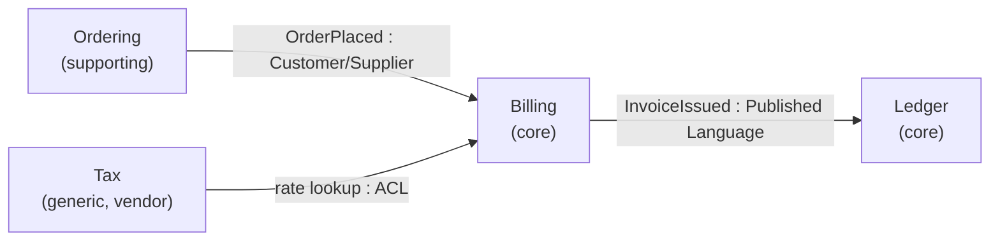
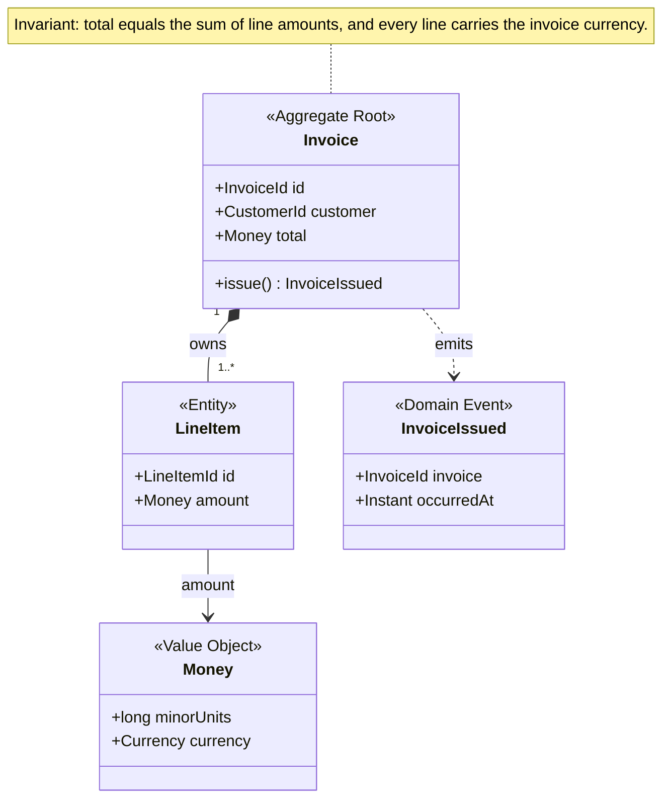
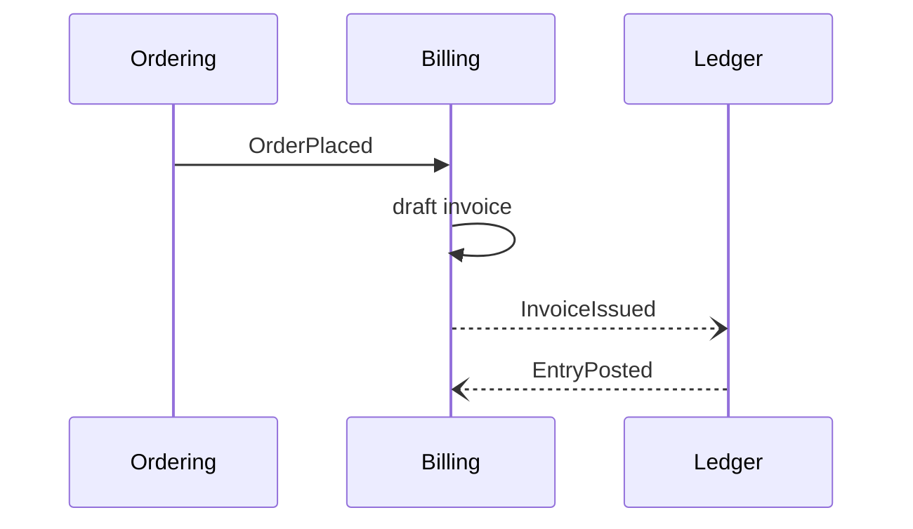

# Artifact notation

Fixed shapes for the artifacts a `ddd` session produces, so two sessions on the same repo stay comparable and a reader who has read one can read the next. Read the section for each artifact the session owes and skip the rest.

| Artifact | Section | Produced when |
| --- | --- | --- |
| Today map | [Context map](#context-map) | a redesign, during the crunch |
| Context map | [Context map](#context-map) | `contexts` settled |
| Glossary | [Ubiquitous language glossary](#ubiquitous-language-glossary) | `language` settled |
| Model diagram | [Model diagram](#model-diagram) | `aggregates` settled |
| Event table and flow | [Domain events](#domain-events) | `events` settled |
| Coverage note | [Coverage](#coverage) | always |

## Context map

One `flowchart LR`, one node per bounded context, labelled with its subdomain class. Every edge runs **upstream to downstream**: the tail's model shapes the head's. Label each edge with what crosses it and the relationship pattern. A vendor you publish to is still upstream, because its format shapes yours: its edge points at you even though your data flows to it (`Installer -->|"manifest format : ACL"| Catalog`).

A redesign draws two maps in this notation: **today**, from the code during the crunch, and **target**, from the session. Open each with one line saying which it is, since a reader who was not in the room has no other way to tell. The today map labels each edge with what crosses it now, carries a pattern only where the code shows one, and leaves subdomain classes off, since the crunch comes before `subdomains` settles.



Name each edge's pattern from this list, so maps from two sessions stay comparable: `Partnership`, `Shared Kernel`, `Customer/Supplier`, `Conformist`, `ACL`, `Open Host Service`, `Published Language`, `Separate Ways`.

Label each node `core`, `supporting`, or `generic`, and mark a vendor or off-the-shelf system, since a boundary you do not control is the one most worth an ACL.

Quote every node label. `Billing (core)` unquoted is a mermaid parse error; `Billing["Billing<br/>(core)"]` is not.

Keep it to the contexts in scope. A map of every service in the company is an org chart, not a model.

## Ubiquitous language glossary

Group by context, since a term only means something inside one. This is `domain-modeling`'s `CONTEXT.md` shape on purpose, so the handoff is a copy rather than a translation. In a repo that already has a `CONTEXT-MAP.md`, each context's entries go to that context's own `CONTEXT.md` instead.

```md
### Billing

**Invoice**:
A request for payment issued after fulfilment, denominated in the currency the customer agreed at order time.
_Avoid_: Bill, statement, charge

**Settlement**:
The match of an inbound payment against an invoice that takes its balance to zero.
_Avoid_: Payment. A payment is money moving; a settlement is the match.
```

- One or two sentences. Define what the term **is**, not what it does.
- `_Avoid_` carries the rejected synonyms. Where two teams genuinely meant different things by one word, say which meaning this context kept, because that sentence is the whole reason the entry exists.
- Skip general programming vocabulary (retries, timeouts, DTOs). Only concepts specific to this domain earn an entry.
- Where the same word survives in two contexts with different meanings, write it in both, and let the two entries contradict each other. That contradiction is the boundary doing its job.
- A term several contexts share on purpose, such as a Published Language, goes under its own `### Across contexts` heading.

## Model diagram

One `classDiagram` per aggregate cluster, three to seven classes. Past that it stops being read.



Stereotype every class from this list, because an unlabelled box hides the one thing the reader needs: `<<Aggregate Root>>`, `<<Entity>>`, `<<Value Object>>`, `<<Domain Event>>`, `<<Repository>>`, `<<Domain Service>>`.

- Composition (`*--`) inside an aggregate; plain association (`-->`) across one, and across a boundary reference by id rather than by object, so the diagram shows the transaction boundary instead of hiding it.
- Give every aggregate root a `note for` stating its invariant. The invariant is why the boundary exists, and nothing else in the notation can say it.
- Show only the fields the invariant or the boundary depends on. A full field list turns the diagram into a worse version of the schema.

## Domain events

One table. Past-tense names, drawn from the glossary.

| Event | Emitted by | Carries | Consumed by | Then |
| --- | --- | --- | --- | --- |
| `OrderPlaced` | Ordering | order id, customer, lines, agreed currency | Billing | opens a draft invoice |
| `InvoiceIssued` | Billing | invoice id, total, currency, due date | Ledger | posts a receivable |

An event carries what its consumers need and nothing more. Every extra field is a piece of the producer's model the consumer can now depend on, which is how two contexts quietly become one.

Add a `sequenceDiagram` once three or more contexts take part, where the ordering is the point:



Use `--)` for asynchronous delivery and `->>` for a synchronous call, since which one it is decides what the consumer can assume about time.

## Coverage

Close every session with this, so a reader can tell a decision from a gap from a guess.

```md
## Coverage

**Draws**: the target state, beside the today map.
**Settled**: subdomains, contexts, language.
**Parked**: `integration`, at the user's call, pending the ledger vendor decision. The context map therefore carries no pattern on Billing to Ledger.
**Stopped**: at the stop question, so `aggregates` and `events` are not modelled.
**Inferred**: `Money` as minor-unit integers, read from `invoices.amount_cents` at `db/schema.sql:41` and not confirmed by an expert.
```
