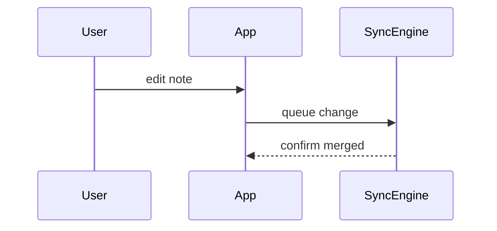

Turn the current topic into the smallest true picture, then read that picture back: a shape that is awkward to draw is usually awkward to use. Two moves, in order: **compress** the topic into the picture, then **collapse** what the picture exposes.

Skip the preamble, keep prose short, and put each visual beside the sentence it supports.

## Draw from the real thing

A tree reads as authoritative whether or not it is true, which makes a guessed picture worse than guessed prose: the reader stops checking. So when the topic is code that already exists, look it up before drawing (`codebase-retrieval`, then read the lines that matter) and carry the real names across. Real functions, files, types, and screens are what let the user check the picture against their code. When the topic is a design that does not exist yet, draw it and label it as the proposal it is.

## Pick the form from the question

| The question | The form |
| --- | --- |
| what happens when this runs | call tree, or a sequence once three or more participants talk |
| what is this made of, where does it live | structure tree or file tree |
| what are the rules, where does it branch | pseudocode |
| what changes | a diff of whichever form already fits the topic |
| why is this so complicated | current shape and smaller shape, side by side |
| what will this look like | one HTML file |

## The forms

Default to pseudocode and plain trees. Every form here describes a *shape*: call order, containment, ownership, flow. A shape is the same whether the code is Kotlin, Swift, Python, Go, Rust, or SQL, and pinning the sketch to one language's syntax only charges the reader a translation. Two cases earn real syntax: the user needs something copyable, or the syntax is itself the point (a `suspend` modifier, a lifetime, a decorator). Write those in the language and idiom of the code under discussion.

- **Pseudocode** for logic, rules, and branching:

```text
on save(draft)
  if draft unchanged since last save
    return cached result
  write draft
  invalidate cache
  return fresh result
```

- **Call tree** for runtime order:

```text
submitPrompt
  createSession
    persistPrompt
    launchAgent
  navigateToSession
```

- **Structure tree** for containment. Annotate only the state, module boundaries, and repetition that bear on the question:

```text
SessionScreen                (ui/session)
  observes sessionEvents
  SessionToolbar
    RunSkillButton           (design-system module)
  SessionTimeline
    MessageRow × n
```

- **File tree** for responsibility, ownership, or the span of a refactor, one line each on what the folder is for:

```text
src/
├── commands/       # parses user actions
├── sessions/       # owns session state
└── transport/      # talks to the API
```

- **Mermaid** for interaction across participants, or a flow no tree can hold:



- **Diff** when the surrounding shape already exists and the point is what moves. Diff is a modifier on every form above, so mark up the form the topic already wanted:

```diff
 SessionScreen
   SessionToolbar
+    RunSkillButton
   SessionTimeline
+    SkillResultCard
```

```diff
 on save(draft)
-  write draft
+  if draft unchanged since last save
+    return cached result
+  write draft
+  invalidate cache
```

- **Full block** when most of it is new, when the omitted context would hide ownership or order, or when the user wants something copyable. This is the form that needs real syntax: write it in the language it will land in.

- **One HTML file** for a visual UI, a layout, a state-by-state comparison, or a concept too dense for Mermaid: a diagram, an infographic, or a few slides, whichever fits the point. Use real labels and real data. Where the product has a visual language, borrow its colors, type, spacing, and components; where it has none (a CLI, a library, a native app with no web surface) the page is still the right view, so keep it plain and readable on a phone as well as a desktop. Then open it:

```
Bash(open path/to/show-me-{topic}.html)
```

## Compress

Before sending, cut every node, file, state, arrow, and boundary the user's current question does not need. The picture is finished when every element left is one they have to see to answer that question, and nothing survives for the sake of completeness. Where you dropped something, leave `…` so the shape stays honest about being partial.

One form usually carries a topic and two make a comparison. Reaching for a third is a sign the topic wants splitting into two answers.

## Collapse

Now read the picture back. Some complexity is only visible once it is drawn, and these shapes are worth naming out loud when they appear:

- a **hub**: one node most of the others reach into
- a **repeat**: the same branch drawn three times under different names
- a **pass-through**: a chain where every level has exactly one child
- a **round trip**: a boundary crossed and then crossed straight back
- a **fan-out on load**: independent calls that all have to land before anything renders

When one shows up, draw the smaller shape beside the current one, in the same notation, and add one line on what it removes: a state, a round trip, a file, a concept the reader no longer has to hold. Keep it obvious which picture is the code and which is the proposal.

Then stop. This skill draws: `codebase-design` carries the vocabulary for reworking an interface, `improve-codebase-architecture` scans for more of the same, and `when-stuck` is for when the smaller shape refuses to appear.

When the picture is already clean, say so in a sentence. Inventing a smell to have something to collapse costs the user their trust in every picture after it.
